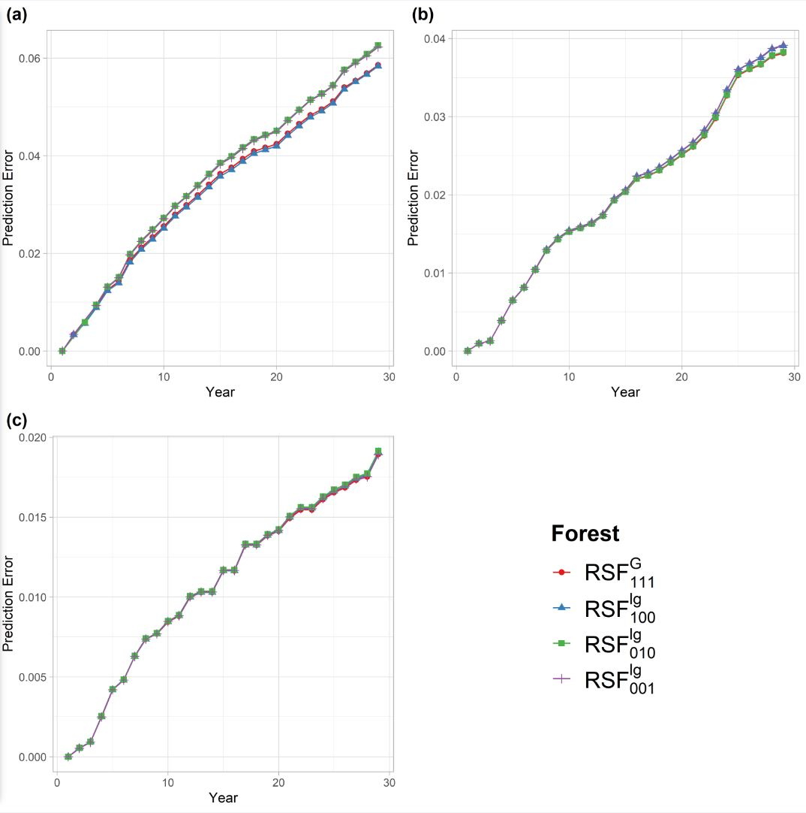
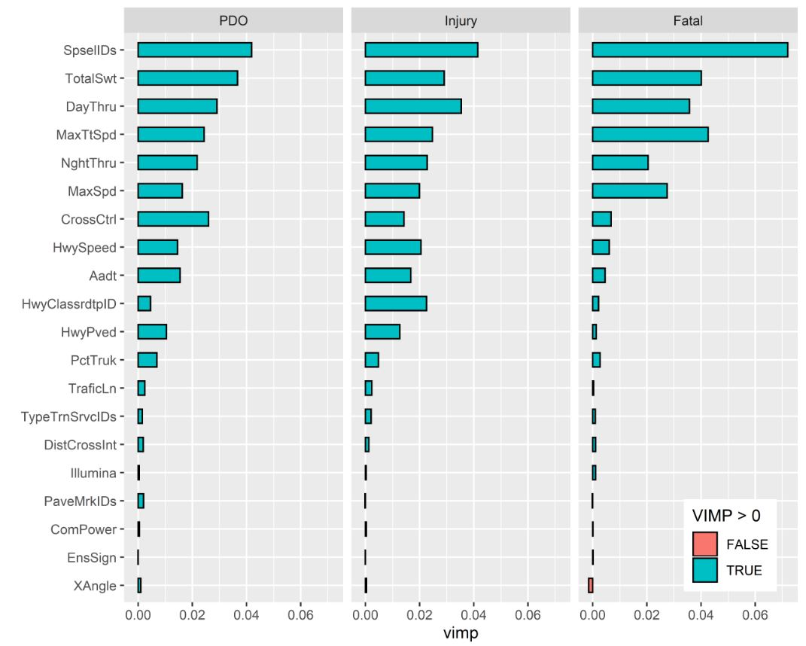
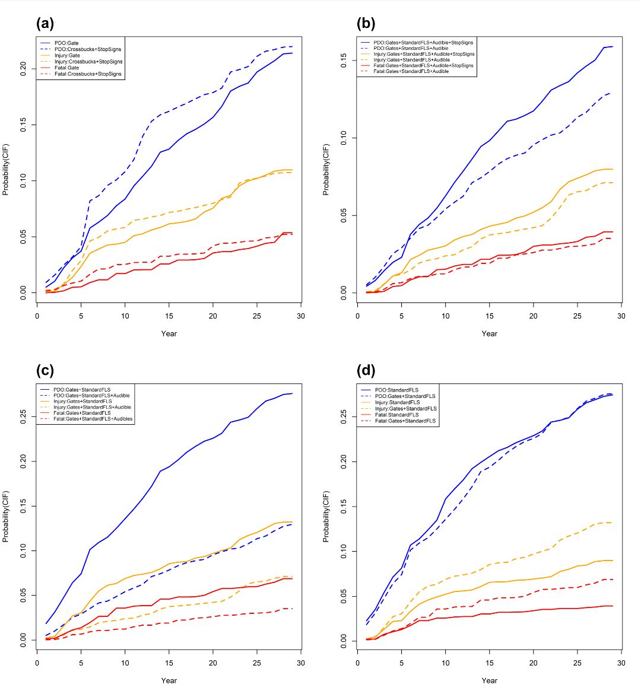

# HRGC-Crash-Severity-Prediction-RSF
This repository provides three R scripts (Step1.R, Step2.R, and Step3.R) to implement the Random Survival Forest method for predicting crash severity and likelihood at Highway-Rail Grade Crossings (HRGCs).

# Introduction  
This repository contains three R scripts (`Step1.R`, `Step2.R`, and `Step3.R`) that guide users through the application of a machine learning prediction model outlined in the article,
[A Crash Severity Analysis at Highway-Rail Grade Crossings: The Random Survival Forest Method](https://doi.org/10.1016/j.aap.2020.105683).
This model is designed to predict both crash severity and occurrence probability at Highway-Rail Grade Crossings (HRGCs) using the Random Survival Forest method.
# R Packages Installation to Start 
To run the Random Survival model, you will primarily need the `randomForestSRC` R package. However, additional packages are required for other analyses, such as estimating VIMP (`ggRandomForests` package), error estimations (`pec` package), and performing other calculations and visualizations. The following code will help you install all the necessary packages if they have not been installed already.

```R
# packages list:
packages <- c("pec", "rms", "riskRegression", "party", "Hmisc", "dynpred",
              "survival", "prodlim", "CompR", "randomForestSRC", "reshape2",
              "expss", "ggRandomForests", "cowplot"
              )

# Executing a Function to install and load packages:
install_load <- function(packages) {
  for(package in packages) {
    if (!require(package, character.only = TRUE)) {
      install.packages(package, dependencies = TRUE)
      library(package, character.only = TRUE)
    }
  }
}

# Using the function:
install_load(packages)
```

# Data 
In our research, we used 29 years worth of data on Highway-Rail Grade Crossings (HRGCs). This data covers all reported crashes and incidents in North Dakota, as well as current and past information about the crossings' design and location.
This information was gathered from three main places:
1.	The North Dakota Department of Transportation provided data about the roads, railways, intersections, and HRGCs.
2.	The Federal Railway Administration provided data about accidents and incidents at these crossings.
3.	The Federal Railway Administration also provided an inventory of these crossings.

In total, we looked at data from 3310 public HRGCs in North Dakota from 1990 to 2018. This included data about the severity of each crash, which we classified into three levels: Property Damage Only (PDO), injury, and fatal.
All the data that we used in our study, from the different sources, and over the 29 years, is summarized in the article’s Table 1. 
In the data folder, you will find a file named StudyData.xlsx, which contains a subset (200 rows) of the original dataset used in the study. The dataset pertains to the proposed RSF (Random Survival Forest) model, which examines two dependent variables: time and status. These variables are attributes in the table.
The variable "time" is a numeric value ranging from 1 to 29, indicating the year of accident occurrence. On the other hand, the variable "status" is either a numeric or categorical variable that represents the severity level of a crash. A value of 0 indicates no crash, 1 represents property damage only (PDO), 2 represents injury, and 3 represents a fatal accident.
The dataset includes various independent variables that impact crash severities. Examples of these variables include geometric characteristics of crossings and different types of traffic controls. These independent variables are believed to influence the severity of crashes.


# Fitting Random Survival Model (`Step1.R`)
### rfsrc(Surv(time,status)
In this study, we fit four RSF models (forests). Three forests are fitted using `log-rank splitting` (refer to Equation 5 in the article) for each crash severity level. These use the following weights:

W<sub>PDO</sub>(t) = 1, W<sub>Injury</sub>(t) = 0, W<sub>Fatal</sub>(t) = 0 for the forest denoted by RSF<sub>100</sub><sup>lg</sup>,
<br>
W<sub>PDO</sub>(t) = 0, W<sub>Injury</sub>(t) = 1, W<sub>Fatal</sub>(t) = 0 for the forest denoted by RSF<sub>010</sub><sup>lg</sup>,
<br>
W<sub>PDO</sub>(t) = 0, W<sub>Injury</sub>(t) = 0, W<sub>Fatal</sub>(t) = 1 for the forest denoted by RSF<sub>001</sub><sup>lg</sup>


Additionally, one forest is fitted using Gray’s modified splitting rules (refer to Equation 6 in the article). This forest, RSF<sub>111</sub><sup>G</sup>, uses weights W<sub>PDO</sub>(t) = 1, W<sub>Injury</sub>(t) = 1, W<sub>Fatal</sub>(t) = 1.
The `Step1.R` script represents the process of fitting all four models using the `rfsrc(Surv(time,status))` function.  The `Bootstrap cross-validation` mode is utilized to select the prediction model with the highest accuracy. This can be achieved using the `Step2.R` scripts. 


# Error Estimation and Model Selection (`Step2.R`)
The `Step2.R` scripts demonstrate how the bootstrap cross-validation approach is used to compare the time-dependent Brier score (BS) of the four fitted forests, and visualize these errors as shown in the figure below.



A total of 100 bootstrap samples of training and test data are considered (B = 100). We use bootstrap without replacement to obtain a training set that comprises roughly 63.2% of the original data (2,092 records). The corresponding test sets comprise approximately 1,218 crossings (3,310 – 2,092 = 1,218).
The above figure, which corresponds to Figure 1 in the article, illustrates the cumulative prediction error (BS) curve of each fitted forest for each crash severity level. In the forest notations in the figure, the superscripts 'G' and 'lg' indicate the Gray’s modified splitting rule and log-rank splitting rule that the forest was built upon, respectively. The subscripts '111', '100', '010', and '001' signify weight combination scenarios for the three severity levels.
In general, the time-dependent BS results shown in the plot below indicate less than 6.2%, 4%, and 2% errors for PDO, injury, and fatal crash probability, respectively, over the 29-year prediction period.
As the forest using the composite Gray splitting rule (RSF<sub>111</sub><sup>G</sup>) exhibited slightly superior performance across all four RSF models with respect to different splitting rules, it is selected as the optimal forest (model) for further analysis. For the next steps, we will use this forest to assess the predictive power of the covariates, and to predict the long-term cumulative probability changes based on various combinations of active and passive crossing controls.


# Model Tuning
The randomForestSRC package provides the `tune.()` function for model tuning. This function allows for adjusting parameters such as `mtry` and `nodesize` to determine the optimal values. The parameters that we tuned in this study are: the `nodesize` which controls the structure of the each individual tree, the number of `mtry` of variables considered as splitting candidate variables which controls level of randomness, the `number of trees` in the forest which controls the structure and the size of the forest, and the `splitting rule` which is splitting criteria in the nodes. Below is the code for tuning the selected model.
```R 
set.seed(3300)
Tun1_rsfG111<- tune(Surv(time,status) ~ ., RFS_P1_2,
     mtryStart = ncol(RFS_P1_2) / 2,
     nodesizeTry = c(1:9, seq(10, 100, by = 5)), 
     ntreeTry = 1500,
     sampsize = function(x){min(x * .632, max(150, x ^ (3/4)))},
     nsplit = 10,
     stepFactor = 1.25, 
     improve = 1e-3, 
     strikeout = 3, 
     maxIter = 25,
     trace = FALSE,
     doBest = TRUE,
     cause= c(1,1,1),
```
The optimal forest can be obtained by using `Tun_rsfG111$rf`, while the optimal `mtry` and `nodesize` can be retrieved from "Tun_rsfG111$optimal".


# Variable Selection and Results (Step3.R)

### Variable Importance (VIMP)

In Random Survival Forests (RSF), variable selection is typically based on Variable Importance (VIMP). Essentially, in RSF, VIMP measures the increase or reduction in prediction error for the forest ensemble when a variable is randomly perturbed or "noised-up" (Breiman, 2001). A larger positive VIMP suggests that the prediction accuracy of the forest is significantly reduced when the corresponding variable is perturbed, indicating that the variable is highly predictive and contributes significantly to the precision of the model's predictions. The event-specific VIMP for each covariate for each crash severity level is estimated using the first part of the scripts in `Step3.R`.

```R
library(ggRandomForests)
vimp<- gg_vimp(rsfG111)
vimp$set <- factor(vimp$set,
                   levels = c("event.1","event.2","event.3"),
                   labels = c("PDO", "Injury", "Fatal"))
```
The prediction error is estimated based on the Brier Score (BS) error of Equation (9) in the article to calculate the event-specific VIMP. The data is then perturbed by random node assignment, and the prediction error is recomputed. The VIMP for each covariate for each crash severity (event) is estimated by the differences in these two values.
The event-specific VIMP ranking, based on the average VIMP of all three crash severities for HRGC covariates in the study, is illustrated in Figure 2 in the article (the following chart), ranging from largest (train detection) at the top, to smallest (crossing angle) at the bottom. The following script was used to plot the VIMPs estimated by the above script.

```R
tiff("C:/Users/VIMPG111_2.tiff", units="in", width=7.5, height=6, res=300) #Replace "C:/Users/VIMPG111_2.tiff" with your desired file save path and name.
plot(vimp)+
  theme(legend.position = c(0.8, 0.2))+ 
  labs(fill = "VIMP > 0")

dev.off()
```
Variables with a VIMP close to zero or negative suggest that they do not contribute to predictive accuracy, or that predictive accuracy may improve when the variable is mis-specified. In other words, zero or negative VIMPs indicate non-predictive variables or noise (Ishwaran et al., 2008; Ishwaran and Kogalur, 2010). Therefore, variables with negative or near-zero VIMP values can be disregarded.
The VIMP in the following chart is calculated based on the forest using the composite Gray splitting rule (RSF<sub>111</sub><sup>G</sup>)The ten most predictive contributors, based on their VIMP, are: train detection device, total switching train traffic, total daytime train traffic, maximum train speed, total nighttime train traffic, motorists’ speed, crossing controls, highway speed limit, annual average daily traffic (AADT), and functional classification of road. As shown in the chart, crossing control is among the top ten contributors with the highest calculated VIMP (seventh) related to the average of all severity levels.
In the next section, we demonstrate the application of the RSF model in predicting long-term cumulative probabilities. We calculate the change in cumulative probability of each crash severity level under the effect of different combinations of active and passive crossing controls by estimating the Cumulative Incidence Function (CIF).



### 2) Prediction of Cumulative Probability (CIF) and Effectiveness of Countermeasures
This research employs the machine learning method of Random Survival Forests (RSF) to examine crash severity at public highway-rail grade crossings (HRGCs) in North Dakota over a 29-year period, from 1990 to 2018. RSF proves its efficacy in identifying cause-specific contributors and modeling crash severity probabilities. The method yields easily understandable results, expressed as cumulative probabilities of estimated crash severities, determined directly through the Cumulative Incidence Function (CIF).
The second script set in Step3.R delineates our CIF estimation process for each crossing control device over the 29-year span. For this study, we've chosen crossing control as a case study for conducting cumulative probability marginal effect analysis, primarily because it ranks among the top 10 contributors with the highest average event-specific VIMP, as demonstrated in the preceding chart.
The RSF model, which uses the composite Gray splitting rule, is employed for predicting cumulative probability, as its performance surpasses other models. We assess the safety outcomes of several combinations of active and passive controls, which include: (1) gate only, (2) standard flashing light only, (3) crossbucks and stop signs, (4) gate and standard flashing light, (5) gate, standard flashing light, and audible device, and (6) gate, standard flashing light, audible device, and stop sign.
We conduct the marginal effect analysis through a non-randomized controlled group comparison. CIFs are computed for each crossing, crash severity level, and year using Equation (8) from the article. Subsequently, we calculate the average yearly CIF for each severity level through Equation (11), incorporating all CIFs for the same type of crossing control. This information allows us to graph the CIF curves over the course of 29 years.
The following figure outlines the three steps in estimating these average annual CIFs, using a crossing equipped with gates and standard flashing lights as an example. As demonstrated in the figure below, the crossing's yearly CIF averages are estimated and the results are compiled in the step2 table. Utilizing this table, we then plot the curves for PDO, Injury, and Fatal CIFs over the span of 29 years in step 3.


The figure referred to as Figure 3 in the article illustrates the predicted cumulative crash severity over 29 years, comparing four pairs of crossing controls, represented in sections a, b, c, and d.



To calculate the model's CIFs and determine the average yearly CIFs for each pair, we utilize the following script. For instance, it's used to calculate for the pair of crossings equipped with 1) "Gates + Standard Flashing Lights + Audible Device + Stop Signs" and 2) "Gates + Standard Flashing Lights + Audible Device". This analysis helps us examine how the cumulative probability of crash severity and occurrence (CIF) changes when a Stop Sign is added to a crossing already equipped with Gates, Standard Flashing Lights, and an Audible Device.
```R
a<- 12
b<- 10
cex=0.65
Dev1<- "Gates+StandardFLS+Audible+StopSigns"
Dev2<- "Gates+StandardFLS+Audible"
cif.PDO <- cbind(apply(cif[,,1][idu == a,], 2, mean),
                 apply(cif[,,1][idu ==b,], 2, mean))
cif.Injury <- cbind(apply(cif[,,2][idu == a,], 2, mean),
                    apply(cif[,,2][idu == b,], 2, mean))
cif.Fatal <- cbind(apply(cif[,,3][idu == a,], 2, mean),
                   apply(cif[,,3][idu == b,], 2, mean))
```
In the above script, we use the `Apply()` function to calculate the `mean` (average) of the CIFs for each year, for each type of crossing control. These control types are represented by categorical variables; for instance, Gates + Standard Flashing Lights + Audible Device + Stop Signs is denoted by 12 (a <- 2) and Gates + Standard Flashing Lights + Audible Device by 10 (b <- 10) in the script.
To graphically represent the results of the script, i.e., the curves pertaining to the yearly average CIFs, we use the `matplot()` function, as shown in the subsequent script.
```R
matplot(Time, cbind(cif.PDO, cif.Injury,cif.Fatal), type = "l",
        lty = c(1,2,1,2,1,2), col = c(4,4,"Orange","Orange", 2,2), lwd = 2,
        ylab = "Probability(CIF)",xlab = "Year")
legend("topleft",
       legend = c(paste("PDO",Dev1,sep = ":"),paste("PDO",Dev2,sep = ":"), 
                  paste("Injury",Dev1,sep = ":"),paste("Injury",Dev2,sep = ":"),
                  paste("Fatal",Dev1,sep = ":"), paste("Fatal",Dev2,sep = ":")),
       lty = c(1,2,1,2,1,2), col = c(4,4,"Orange","Orange", 2,2), 
       lwd = 1, cex = cex)
title("(b)",cex.main=2, adj=0,line = 1)]
```
The result of the above script is depicted as part b in the previously mentioned Figure 3. We used the same process to create the other three plots. From part b, we can infer that adding a stop sign to the existing combination of a gate, standard flashing light, and audible device reduces the cumulative probabilities of Property Damage Only (PDO) and fatal crashes up until the seventh year. However, beyond this point, the crossings are more prone to PDO and fatal crashes. Moreover, over the 29-year span, the likelihood of injury crashes is slightly higher (an average increase of 12%) at crossings where a stop sign has been added. This trend could be attributed to some drivers getting confused about how far they should check for traffic when stop signs are used at HRGCs (Jeng, 2005).
The RSF approach to competing risks proves its effectiveness in identifying risk factors and their marginal probabilities for crash severity by calculating event-specific Variable Importance (VIMP) and event-specific CIF. The model delivers precise results in identifying and summarizing the contributing factors and risks. For further details about fitting the Random Survival Forest Model to Crash Prediction, please refer to the publication link [here](https://doi.org/10.1016/j.aap.2020.105683).

# Citation 
Please kindly cite the following paper when utilizing our data or code: 

```
@article{keramati2020crash,
  title={A crash severity analysis at highway-rail grade crossings: The random survival forest method},
  author={Keramati, Amin and Lu, Pan and Iranitalab, Amirfarrokh and Pan, Danguang and Huang, Ying},
  journal={Accident Analysis \& Prevention},
  volume={144},
  pages={105683},
  year={2020},
  publisher={Elsevier}
}
```
